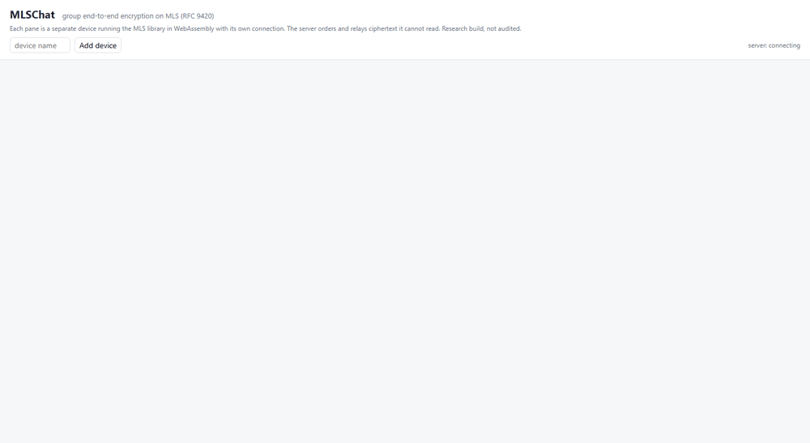

# MLSChat

MLSChat is end-to-end encrypted group chat built on Messaging Layer Security (MLS, RFC 9420),
the 2023 IETF standard for group encryption. It is written in Rust from the RFC: a client library
checked against the official test vectors and against OpenMLS, plus a delivery service that totally
orders each group's changes so concurrent edits cannot split a group. It measures where the
standard's ratchet tree pays off against the Sender Keys and pairwise designs most apps shipped.
It is a research build. It has not been audited, and you should not use it to protect real
conversations. Every load figure comes from simulated clients on one shared mini PC (a 2-vCPU WSL2
VM), not from a production deployment.



<p align="center"><em>Three browser devices, each running the MLS library compiled to WebAssembly over its
own connection. Orange nodes were re-keyed by the last commit; blue ones are keys this device holds.
Recorded from the running app.</em></p>

## What it shows

| | Result | Source |
| --- | --- | --- |
| Conformance | **785 of 785** official test-vector cases pass, all **16** vector files, all **7** cipher suites, nothing skipped | `results/exp5_conformance.jsonl` |
| Differential | **300 of 300** randomized sessions mixing MLSChat and OpenMLS members agree on every one of **9,816** epochs | `results/exp5_conformance.jsonl` |
| Interop harness | the working group's own gRPC test-runner drove MLSChat with OpenMLS: **2,400 of 2,400** mixed `commit` runs and every mixed `welcome_join`, `application` and `external_join` run pass | `results/interop.jsonl` |
| Remove a member, 10,000-member group | **4.6 ms** for the committer and **2.5 KB** on the wire, against **95 s** of total device CPU and **8.8 GB** for Sender Keys to re-key every sender | `results/exp1_membership.jsonl` |
| Concurrent commits | **0 of 200** trials fork with epoch fencing; without it, every concurrent add strands its newcomer (100 of 100) | `results/exp3_concurrency.jsonl` |
| Chaos | **0** lost, duplicated or reordered of **513,600** deliveries (36,800 messages) through **123** server SIGKILLs and 755 dropped connections | `results/exp4_chaos.jsonl` |
| Model check | TLC proves no fork and "an ack means applied" for the fenced design and finds counterexamples for three unfenced ones | `results/model_check.jsonl` |

Every number, with its conditions and caveats, is in [`NUMBERS.md`](NUMBERS.md).

## How it works

```
 device (MLS in Rust or WASM)  ──┐
 device                        ──┼── WebSocket ──►  delivery service (Tokio)
 device                        ──┘                   per-group lock: fence → durable append → fan-out
                                                     RocksDB: log | meta | dedupe | cursor | inbox
```

**The library** (`crates/mls`) implements RFC 9420 end to end: the TLS codec, tree math, the
ratchet tree with tree and parent hashes, TreeKEM, the key schedule, secret tree, PublicMessage and
PrivateMessage protection, Welcome, external commits, PSKs, and all seven cipher suites. HPKE
(RFC 9180) is implemented in the crate on top of RustCrypto and dalek primitives.

**The delivery service** (`crates/ds`) gives each group one log. A commit is accepted only if it
was built on the group's current epoch (epoch fencing); a loser is told the current epoch,
catches up, and retries. Sends carry an idempotency key and, for application messages, a
per-sender sequence number, both written in the same RocksDB batch as the log entry, so retries
after a crash never duplicate or reorder. Offline devices catch up from their cursor. The server
reads only MLS framing headers and never sees plaintext.

**Why the server must order commits.** Two members who commit at once both build epoch e+1 from
epoch e. If different members apply different commits, the group has split into two groups that
cannot read each other. The [TLA+ model](docs/tla/DeliveryService.tla) shows that a single log
order is enough to keep existing members together, but only fencing makes the server's
acknowledgement mean the commit took effect, which is what a committer and its newcomers rely on.
[`DESIGN.md`](DESIGN.md) has the details.

## Repository

| Path | What |
| --- | --- |
| `crates/mls` | The MLS library |
| `crates/conformance` | Official test-vector runner (`mls-conformance`) |
| `crates/differential` | Randomized MLSChat/OpenMLS sessions |
| `crates/ds`, `crates/wire` | Delivery service and its protocol |
| `crates/client` | Native client, plus the M2 property test |
| `crates/web`, `web/` | Browser client (WASM) and demo UI |
| `crates/baselines` | Pairwise and Sender Keys |
| `crates/experiments` | exp1 to exp4 and the load test |
| `crates/interop` | gRPC client for the `mls-implementations` interop harness |
| `docs/tla` | TLA+ model of commit ordering and epoch fencing |
| `fuzz/` | cargo-fuzz targets for the decoders and message processing |

## Run it

Everything heavy (toolchain, target dir, vectors) lives outside the repo under `$MLS_WORK`
(default `~/mlschat-work`); `scripts/env.sh` sets it up.

```bash
source scripts/env.sh
scripts/fetch-vectors.sh                                  # official vectors, pinned commit
cargo run --release -p conformance --bin mls-conformance  # vector pass counts
cargo test --release --workspace --exclude web            # unit, group and property tests
cargo run --release -p differential -- 100 40             # OpenMLS differential
scripts/build-web.sh                                      # browser client
cargo run --release -p ds --bin mlschat-ds -- --web web   # then open http://localhost:7070/?demo=1
```

The experiments are `cargo run --release -p experiments --bin exp1_membership` (and `exp2_send`,
`exp3_concurrency`, `exp4_chaos`, `loadtest`); each appends to `results/*.jsonl` with the machine
and load recorded on every line.

## Limits, stated up front

- Not audited. Constant-time behaviour is whatever the underlying crates provide.
- Credentials are bare identities; there is no identity verification or key transparency.
- The server trusts the committer's list of added and removed devices for fan-out (it cannot add
  a reader, but a malicious member could starve someone of messages).
- ReInit and branch exist for the interop harness; the chat client and server do not expose them.
- One process, one RocksDB; no replication. A disk loss loses the log.

## Credits

RFC 9420 and RFC 9750 (MLS), RFC 9180 (HPKE), the `mlswg/mls-implementations` test vectors and
interop harness, OpenMLS, the Signal project's Sender Keys and X3DH descriptions, and TLA+. See
[`DESIGN.md`](DESIGN.md#credits).
